# Inversion of Control

The approach of outsourcing tha construction and management of objects

Suppose there is a class CricketCoach which has a method getDailyWorkout(),
now, we should be able to easily change the coach for another sport
eg. Baseball, Hockey etc

## Ideal Solution

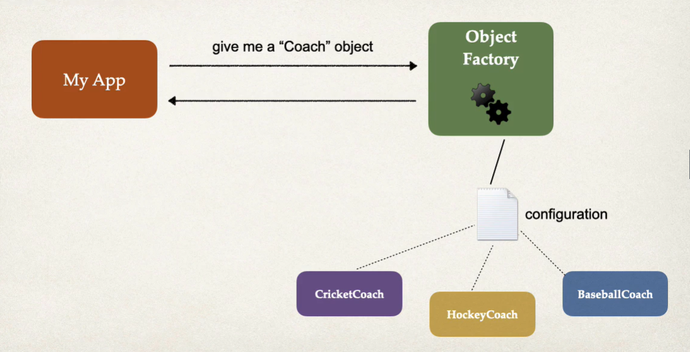

## Spring Container

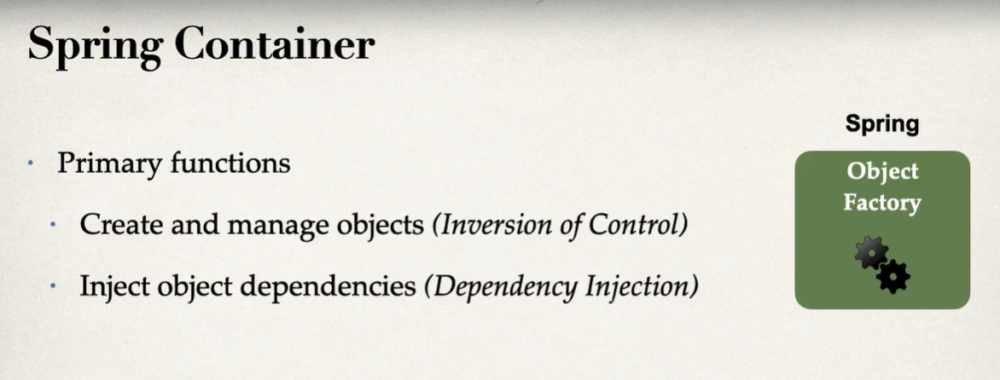

## Configure Spring Container
1. XML Configuration (legacy)
2. Java Annotations (modern)
3. Java Source Code (modern)

## Dependency Injection

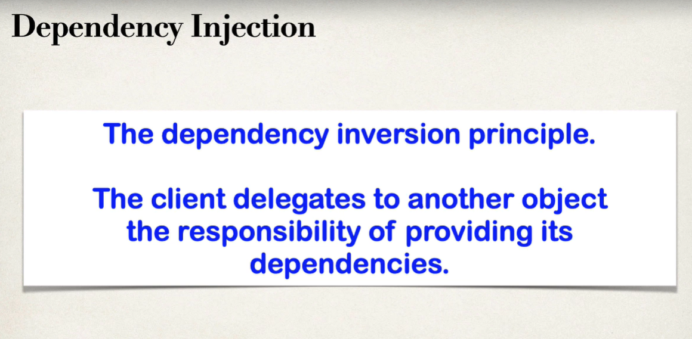

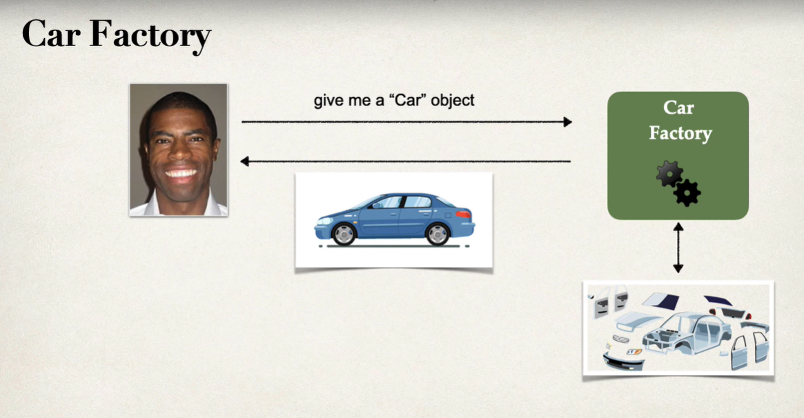

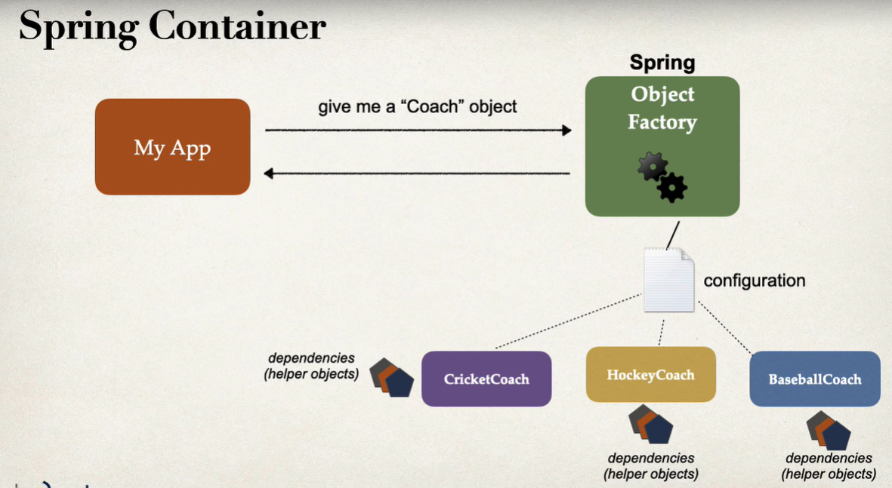

### Demo of dependency injection

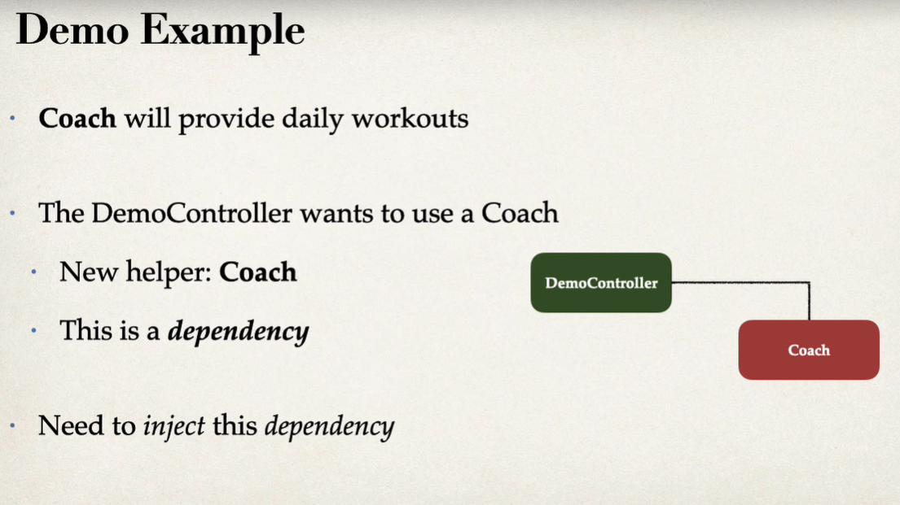

### Types of dependency injection

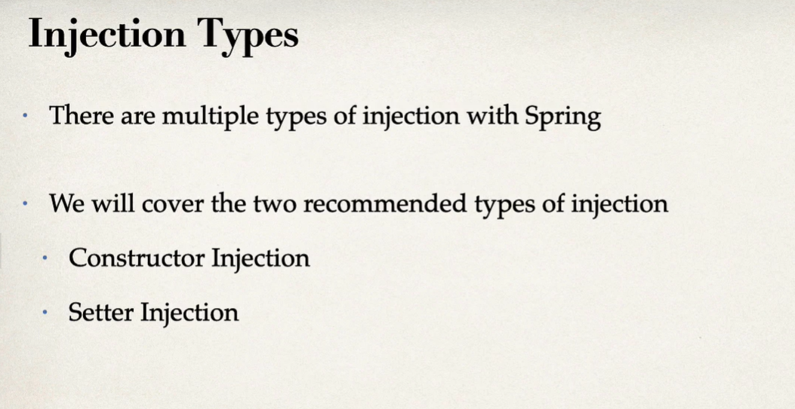

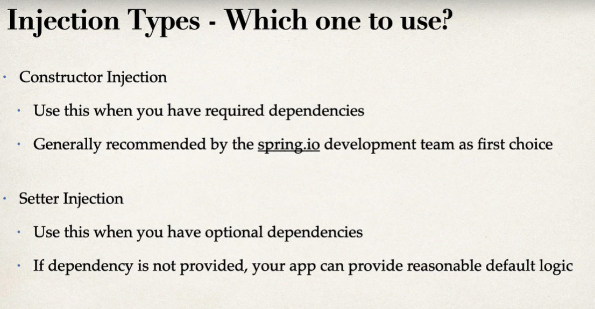

## Spring AutoWiring

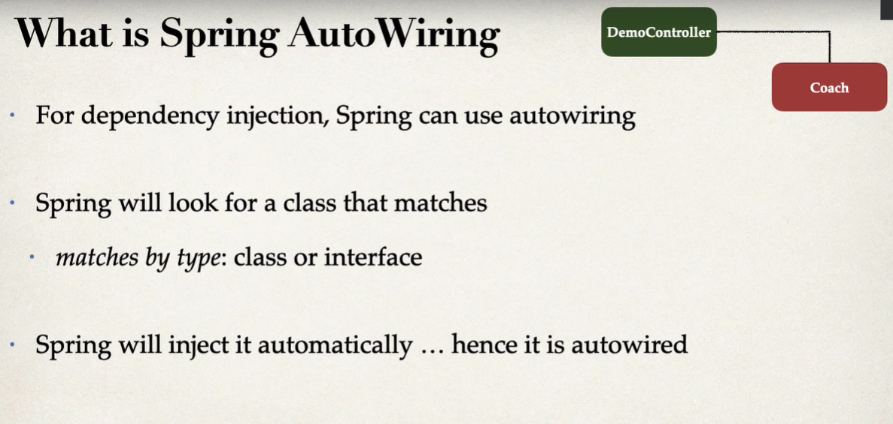

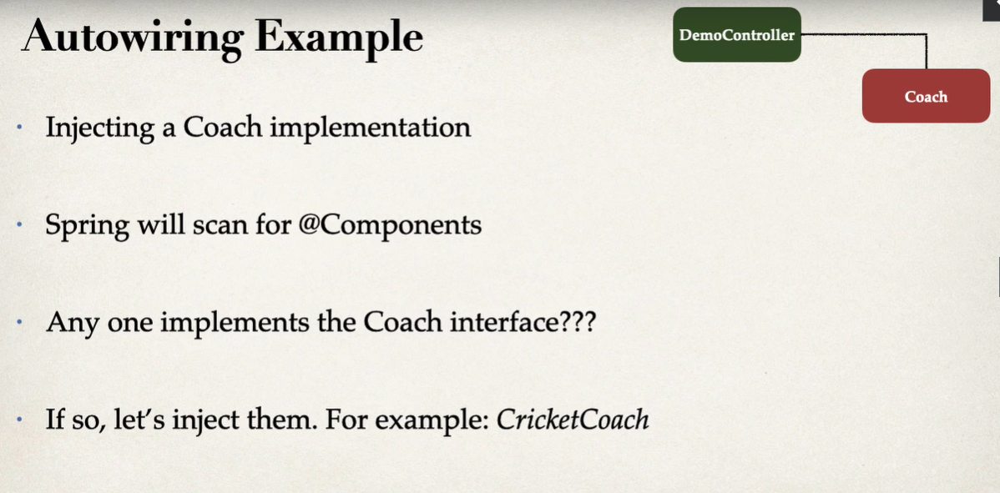
 

### Example of dependency injection in an application

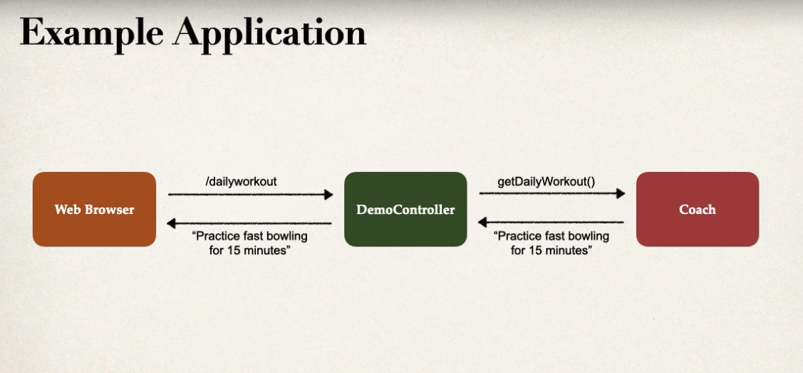

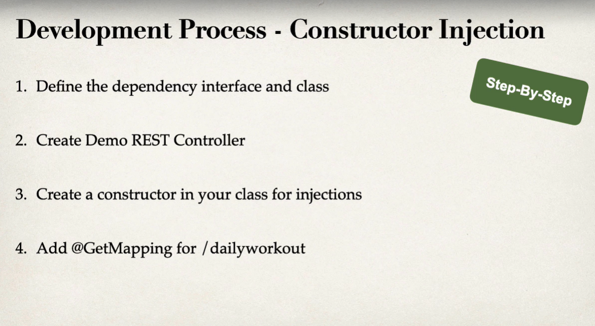

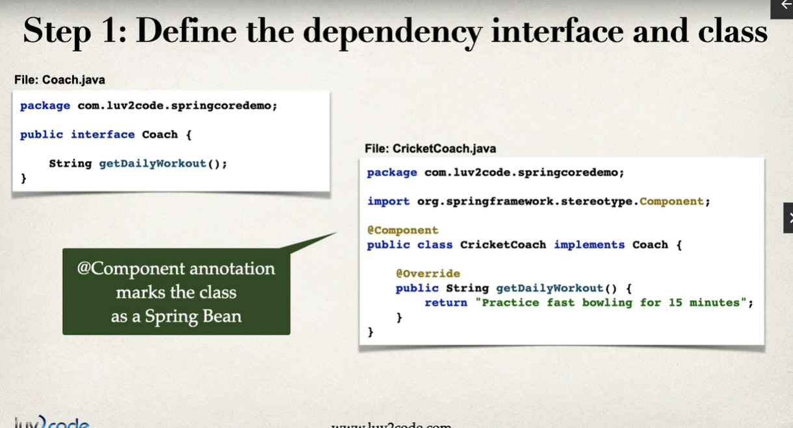

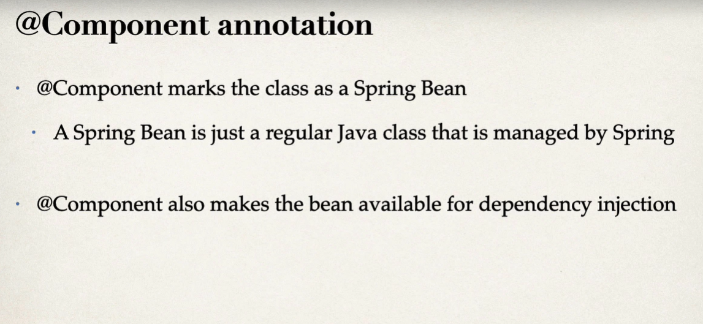

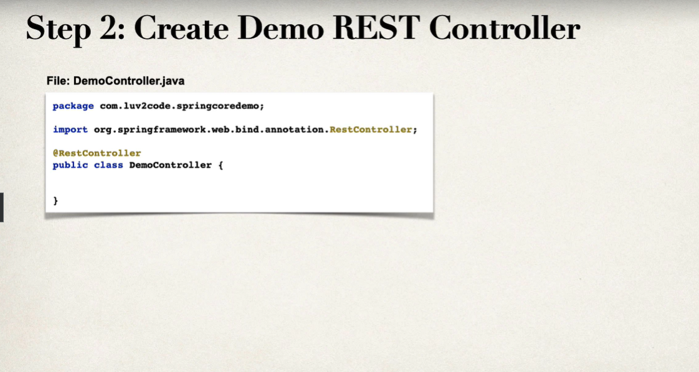

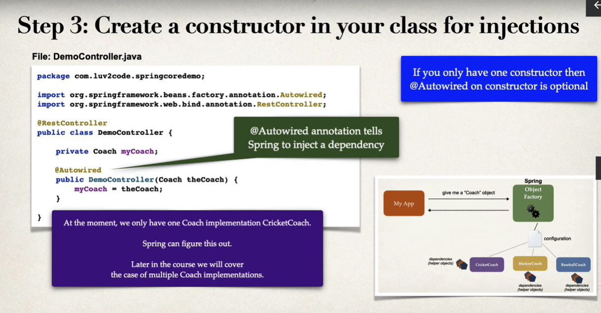

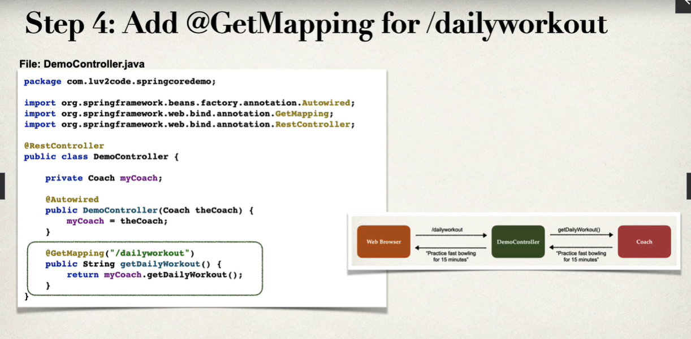